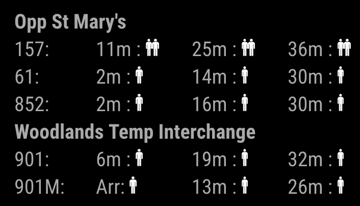

# MMM-SG-Transport-V2
MagicMirror² Module - Local Transport in Singapore

This module displays data about bus arrivals. More than one bus stop can be specified.

This module aims to provide the most compact display possible with multiple bus stops.

Data is sourced from [LTA DataMall v2](https://www.mytransport.sg/content/mytransport/home/dataMall.html), you need to get your own API key here.

This module works with [MagicMirror2](https://github.com/MichMich/MagicMirror) project by [MichMich](https://github.com/MichMich/)

[MagicMirror2 Forum](http://forum.magicmirror.builders/)

## Screenshots

## Legend

The number of stickman refers to the crowd level on the bus.

1 stickman - Seating available
2 stickman - Standing available
3 stickman - Limited standing

## Prerequisite
A working installation of [MagicMirror2](https://github.com/MichMich/MagicMirror)
 
## Dependencies
  * npm
  * [unirest](https://www.npmjs.com/package/unirest)

## Installation
1. Navigate into your MagicMirror's `modules` folder.
2. Execute `git clone https://github.com/mosesyong/MMM-SG-Transport-V2`.
3. Execute `cd MMM-SG-Transport-V2`.
4. Execute `npm install`.
5. Edit the `config.js`.

## Configuration
Sample configuration entry for your `~/MagicMirror/config/config.js`:

    {
        module: 'MMM-SG-Transport-V2',
        position: 'top_left',
        config: {
            lta_api_key: "...",
            refresh_interval: 30 * 1000,
            bus_stops: [
                {
                    BusStopCode: 43191,
                    name: "Opp St Mary's",
                    BusNumbers: [
                        "157",
                        "61",
                        "852"
                    ]
                },
                {
                    BusStopCode: 43619,
                    name: "Opp Caltex"
                }
            ]
        }
    },
<table>
  <thead>
    <tr>
      <th>Option</th>
      <th>Description</th>
    </tr>
  </thead>
  <tbody>
    <tr>
      <td><code>lta_api_key</code></td>
      <td><strong>REQUIRED</strong> API Key from LTA DataMall.  <strong>Type:</strong> <code>string</code></td>
      <tr>
      <td><code>refresh_interval</code></td>
      <td><strong>OPTIONAL</strong>  Optional integer value representing how often the data should be refreshed in ms.  <strong>Type:</strong> <code>integer</code></td>
      </tr>
      </tr>
      <td><code>BusStopCode </code></td>
      <td><strong>REQUIRED</strong> Bus stop number.  <strong>Type:</strong> <code>integer</code></td>
      </tr>
      <tr>
      <td><code>name </code></td>
      <td><strong>REQUIRED</strong> Custom bus stop name for the display.  <strong>Type:</strong> <code>string</code></td>
      </tr>
      <tr>
      <td><code>BusNumbers </code></td>
      <td><strong>OPTIONAL</strong>  Optional array of string containing bus numbers you wish to display. Invalid bus numbers will be ignored. In string format as bus numbers can contain alphabets.
  <strong>Type:</strong> <code>Array[string]</code></td>
      </tr>
  </tbody>
</table>

## Acknowledgements
- [MMM-HK-Transport](https://github.com/winstonma/MMM-HK-Transport) by [winstonma](https://github.com/winstonma)
- [MMM-SG-Transport ](https://github.com/xuanyou/MMM-SG-Transport) by [xuanyou] (https://github.com/xuanyou) (Depreciated)

## License
MIT License

Copyright (c) 2020 Moses Yong (https://github.com/mosesyong/)

Permission is hereby granted, free of charge, to any person obtaining a copy
of this software and associated documentation files (the "Software"), to deal
in the Software without restriction, including without limitation the rights
to use, copy, modify, merge, publish, distribute, sublicense, and/or sell
copies of the Software, and to permit persons to whom the Software is
furnished to do so, subject to the following conditions:

The above copyright notice and this permission notice shall be included in all
copies or substantial portions of the Software.

THE SOFTWARE IS PROVIDED "AS IS", WITHOUT WARRANTY OF ANY KIND, EXPRESS OR
IMPLIED, INCLUDING BUT NOT LIMITED TO THE WARRANTIES OF MERCHANTABILITY,
FITNESS FOR A PARTICULAR PURPOSE AND NONINFRINGEMENT. IN NO EVENT SHALL THE
AUTHORS OR COPYRIGHT HOLDERS BE LIABLE FOR ANY CLAIM, DAMAGES OR OTHER
LIABILITY, WHETHER IN AN ACTION OF CONTRACT, TORT OR OTHERWISE, ARISING FROM,
OUT OF OR IN CONNECTION WITH THE SOFTWARE OR THE USE OR OTHER DEALINGS IN THE
SOFTWARE.
